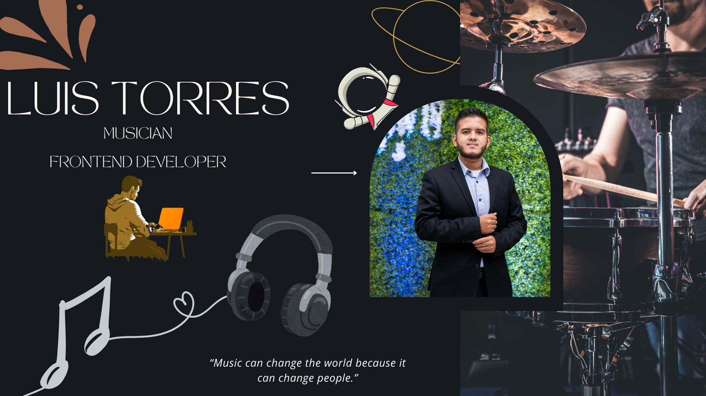

<h1 align="center"><b>Hi </b></h1>

---

  

  

  

  

## 👨‍💻 Sobre mí

Soy **Frontend Developer** y también **músico**.

Me considero alguien curioso, siempre buscando aprender y mejorar.
El código me reta a pensar con lógica, la música me recuerda que también hay que crear con alma.

Cuando programo, la música siempre está presente, convierte el trabajo en un espacio donde puedo disfrutar de ambos mundos.

Creo que tanto el desarrollo como la música tienen algo en común: ambos son lenguajes universales, y para mí son formas de expresión que me permiten crecer y conectar con los demás.

  

## 🚀 Tecnologías que uso

  
  
  
  
  
  
  
  
  
  
  
  
  
  
  
  
  
  
  
  
  
  
  

  

## 📖 Aprendiendo ahora

  

  

## 📊 Estadísticas reales

💻 Código: **50%**  
🎶 Música: **50%**  
🐞 Bugs: **100%** (que luego arreglo)  

